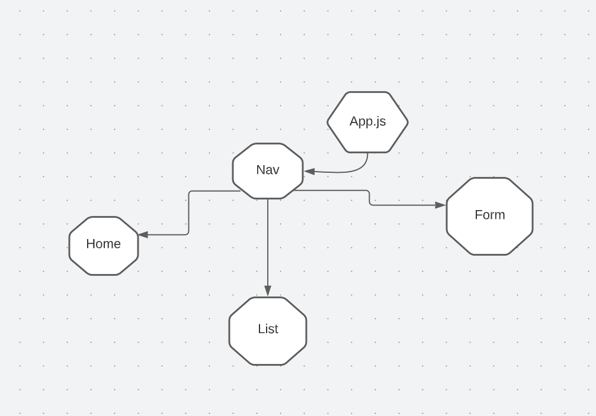

# Travel-Itinerary
Pick and add places to visit

#### Date 7/3/2022

### By Maham Almizan Khan

### Links to accounts

[CHD](https://lucid.app/lucidspark/6a499971-9765-4215-b0c0-38d55191813d/edit?viewport_loc=-8%2C21%2C1440%2C724%2C0_0&invitationId=inv_ecf9a953-1764-4fb6-91a8-fcbf754597de#) | [Trello](https://trello.com/invite/b/FgvTgfVN/9b6c9b0eab2f16e7d8a66e975a3a4d51/travel-itinerary) |[ERD](https://lucid.app/lucidchart/df9e3bd4-7584-4784-ad02-3ee4e5b266d5/edit?viewport_loc=-11%2C-10%2C1579%2C857%2C0_0&invitationId=inv_21e096c3-52fa-42f0-99da-4e1f74c24680#)

---

### **_Description_**

#### MERN project to add or remove places.

---

### **_Technologies Used_**

- HTML
- CSS
- MONGODB
- REACT
- EXPRESS
- NODE.JS

---

### **_Credits_**

---

### **_Post MVP_**

1. Add pictures
2.Edit dates

### **Screenshots**

---

### Sources

- [Images](https://www.google.com/?&bih=839&biw=1500&hl=en)
- [Markdown Cheatsheet](https://www.markdownguide.org/cheat-sheet/)
- [Charts](https://lucid.app/documents#/documents?folder_id=home)

